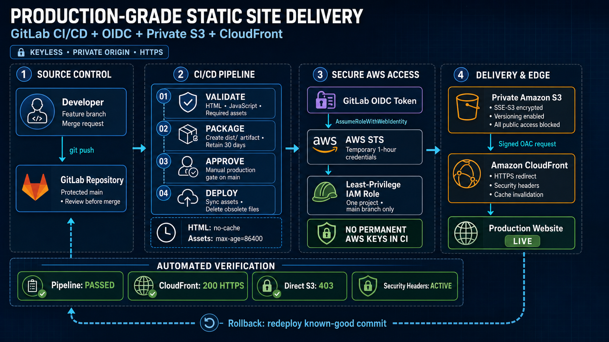

# Secure Static Website Deployment using GitHub Actions

## Project Overview

This project demonstrates a production-ready workflow for building, validating,
and deploying a responsive static website to AWS.

GitHub Actions validates and packages the frontend, obtains temporary AWS
credentials through OpenID Connect (OIDC), uploads the application to a private
Amazon S3 bucket, and serves it globally over HTTPS through Amazon CloudFront.

The application is built with HTML, CSS, and JavaScript and does not require a
runtime server or frontend build framework.

Production URL:
[https://d3tt9aj7gt60mn.cloudfront.net](https://d3tt9aj7gt60mn.cloudfront.net)

Setting up from scratch? See [Start.md](Start.md) for the full manual,
console-driven walkthrough (repo, AWS resources, IAM role, pipeline,
approvals, rollback, email alerts).

## Architecture

```text
Developer
   |
   | git push
   v
GitHub Repository
   |
   | GitHub Actions
   v
Validate -> Package -> Manual Approval -> Deploy
   |
   | GitHub OIDC token
   v
AWS STS -> Least-Privilege IAM Role
   |
   | aws s3 sync
   v
Private Amazon S3 Bucket
   |
   | Signed Origin Access Control requests
   v
Amazon CloudFront
   |
   | HTTPS
   v
Browser
```

CloudFront is the only public entry point. Direct access to objects in the S3
bucket is blocked.

## Technologies Used

- HTML5
- CSS3
- JavaScript
- Git and GitHub
- GitHub Actions
- GitHub OpenID Connect
- AWS Identity and Access Management
- AWS Security Token Service
- Amazon S3
- Amazon CloudFront
- CloudFront Origin Access Control
- Terraform
- AWS CLI
- GitHub-hosted Actions runners

## Architecture Diagram



The diagram covers source control, pipeline validation, temporary AWS
authentication, private storage, edge delivery, automated verification, and
rollback.

## Prerequisites

Before creating another deployment, ensure that you have:

- An AWS account
- A GitHub account and repository
- Git installed locally
- Terraform `1.15.x`
- AWS CLI access for infrastructure administrators
- Permission to create S3, CloudFront, IAM, and OIDC resources
- A protected GitHub production branch, normally `main`
- The exact GitHub `owner/repository` path

No permanent AWS credentials are required in GitHub Actions.

## AWS Resources

The deployment uses:

| Resource | Purpose |
|---|---|
| Amazon S3 | Private storage for the static website files |
| Amazon CloudFront | Global HTTPS delivery and caching |
| Origin Access Control | Signed access from CloudFront to S3 |
| IAM OIDC provider | Trust relationship with GitHub Actions |
| IAM deployment role | Temporary least-privilege pipeline access |
| AWS STS | Exchanges the GitHub token for temporary credentials |

The current production environment uses:

```text
Region: us-east-1
S3 bucket: bmw-x6-static-prod-app-278261170910
CloudFront distribution: EXVN0DAFZ24IG
```

Detailed configuration:

- [S3 policy](docs/s3-policy.md)
- [CloudFront configuration](docs/cloudfront-config.md)
- [IAM role and OIDC trust](docs/iam-role.md)

## GitHub Actions Configuration

Protect the `main` branch and create a `production` environment
(**Settings → Environments**) with required reviewers, so the `deploy` job
pauses for manual approval. Then configure these repository variables
(**Settings → Secrets and variables → Actions → Variables**):

```text
AWS_REGION
AWS_ROLE_ARN
S3_BUCKET
CLOUDFRONT_DISTRIBUTION_ID
SITE_URL
```

The production job requests an OIDC ID token:

```yaml
permissions:
  id-token: write
  contents: read
```

The AWS IAM trust policy restricts role assumption to:

- The GitHub Actions OIDC provider (`token.actions.githubusercontent.com`)
- The `sts.amazonaws.com` audience
- One GitHub repository
- The protected `main` branch

Do not create `AWS_ACCESS_KEY_ID` or `AWS_SECRET_ACCESS_KEY` GitHub secrets.

## Deployment Pipeline

The pipeline is defined in [.github/workflows/deploy.yml](.github/workflows/deploy.yml)
and contains four jobs:

### 1. Validate

- Confirms required source files and assets exist
- Parses JavaScript using `node --check`
- Validates HTML using `html-validate`

### 2. Package

- Copies deployable files into `dist/`
- Excludes documentation, Git metadata, and source references
- Retains the workflow artifact for 30 days

### 3. Deploy

- Runs only for the protected `main` branch
- Requires approval on the `production` environment
- Exchanges the GitHub OIDC token for temporary AWS credentials
- Uploads the application with `aws s3 sync`
- Removes obsolete deployed assets
- Applies separate cache policies for HTML and static assets
- Creates and waits for a CloudFront invalidation

### 4. Verify

- Confirms the CloudFront website returns successfully
- Checks the expected HTML title
- Confirms the hero image is available through CloudFront

## Project Structure

```text
.
├── .github/
│   └── workflows/
│       └── deploy.yml
├── README.md
├── docs/
│   ├── DEPLOYMENT_RUNBOOK.md
│   ├── architecture-diagram.png
│   ├── s3-policy.md
│   ├── cloudfront-config.md
│   └── iam-role.md
├── website/
│   ├── index.html
│   ├── styles.css
│   ├── script.js
│   └── assets/
│       └── bmw-x6-hero.png
├── screenshots/
│   ├── 01-cicd-pipeline.png.png
│   ├── 02-oidc-role.png.png
│   ├── 03-s3-bucket.png.png
│   ├── 04-cloudfront.png.png
│   ├── 05-IAMrole.png.png
│   └── 06-live-website.png.png
└── terraform/
    ├── .terraform.lock.hcl
    ├── README.md
    ├── provider.tf
    ├── variables.tf
    ├── s3.tf
    ├── cloudfront.tf
    ├── iam.tf
    ├── outputs.tf
    └── terraform.tfvars.example
```

## Security Best Practices

- Keep the S3 bucket private.
- Enable all four S3 Block Public Access controls.
- Use bucket-owner-enforced object ownership.
- Enable S3 versioning and server-side encryption.
- Use CloudFront OAC with signed SigV4 origin requests.
- Redirect HTTP viewers to HTTPS.
- Attach CloudFront security response headers.
- Use GitHub OIDC and temporary AWS STS credentials.
- Restrict IAM trust to one repository and protected branch.
- Grant deployment access only to the required bucket and distribution.
- Require manual approval before production deployment.
- Never commit tokens, AWS keys, Terraform state, plan files, or populated
  private variable files.
- Rotate any credential exposed through a terminal, log, screenshot, or chat.

## Deployment Steps

### 1. Clone the repository

```bash
git clone https://github.com/hemanth-kumar/REPLACE_WITH_REPO.git
cd REPLACE_WITH_REPO
```

### 2. Configure Terraform

```bash
cd terraform
cp terraform.tfvars.example terraform.tfvars
```

Replace every `REPLACE_WITH_...` placeholder.

### 3. Initialize and validate

```bash
terraform init
terraform fmt -check
terraform validate
```

### 4. Review and apply

```bash
terraform plan -out=tfplan
terraform apply tfplan
```

### 5. Configure GitHub Actions variables

Display the required values:

```bash
terraform output github_actions_variables
```

Add the output values under **GitHub → Settings → Secrets and variables →
Actions → Variables**.

### 6. Deploy the application

```bash
git checkout -b feature/update-site
git add .
git commit -m "Update static website"
git push -u origin feature/update-site
```

Open a pull request, allow validation to pass, and merge into `main`.

### 7. Approve production

Open the resulting `main` workflow run under the **Actions** tab and approve
the `production` environment when the `deploy` job requests review. The
verify job runs after the deployment completes.

For complete setup, troubleshooting, and rollback instructions, see the
[deployment runbook](docs/DEPLOYMENT_RUNBOOK.md).

## Verification

Check the CloudFront website:

```bash
curl -I https://d3tt9aj7gt60mn.cloudfront.net
```

Expected result:

```text
HTTP/2 200
```

Check a static asset:

```bash
curl -I \
  https://d3tt9aj7gt60mn.cloudfront.net/assets/bmw-x6-hero.png
```

Expected result: `200`.

Confirm direct S3 access is blocked:

```bash
curl -o /dev/null -s -w '%{http_code}\n' \
  https://bmw-x6-static-prod-app-278261170910.s3.us-east-1.amazonaws.com/index.html
```

Expected result:

```text
403
```

Also verify:

- GitHub Actions workflow run is successful
- HTTP redirects to HTTPS
- Security headers are present
- CloudFront serves the latest deployment
- Direct S3 access remains unavailable

## Future Improvements

- Store Terraform state in a dedicated encrypted and versioned remote backend
- Add native Terraform state locking
- Add an infrastructure plan/apply pipeline separate from application delivery
- Support existing and newly created GitHub OIDC providers
- Add S3 noncurrent-version lifecycle retention
- Enable CloudFront access logging
- Add CloudWatch monitoring and error-rate alarms
- Add an AWS Budget and cost notifications
- Configure a custom domain with ACM and Route 53
- Add AWS WAF for additional edge protection
- Add a custom Content Security Policy
- Add automated browser tests and accessibility checks
- Create separate development, staging, and production environments

## Author

**Santhosh Kumar P**
